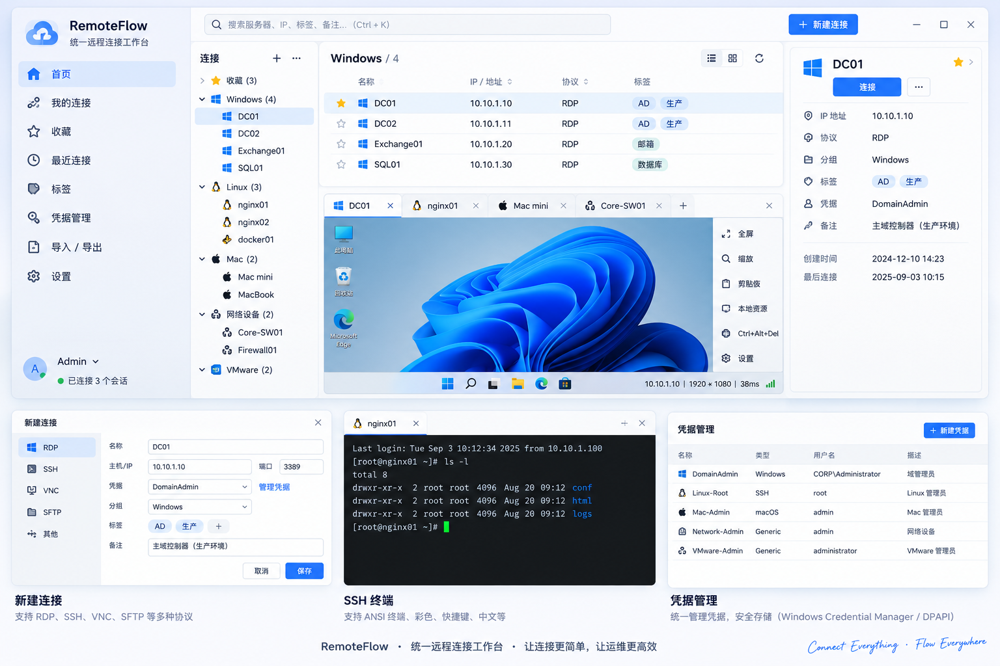
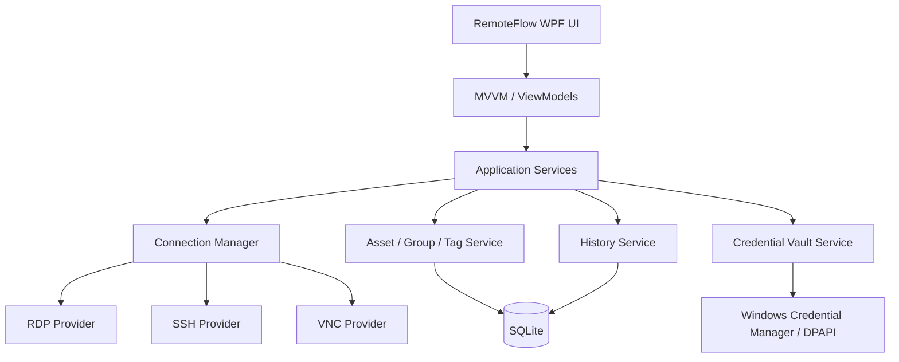

# RemoteFlow 产品设计文档

> **产品名称：** RemoteFlow  
> **产品定位：** Unified Remote Connection Workspace / 统一远程连接工作台  
> **文档版本：** V1.1  
> **日期：** 2026-09-03  
> **状态：** 产品与 UI 基线 / 可进入 V0.1 开发

---

## 1. 文档目的

本文档用于固化 RemoteFlow 的首版产品方向、功能边界、UI/交互原则、技术基线、安全模型与版本路线，作为后续产品设计、Claude Code 开发、测试验收和版本迭代的统一依据。

RemoteFlow 第一阶段不是 TeamViewer / AnyDesk 类型的公网穿透远控产品，而是面向 IT 运维、系统管理员、开发与技术支持人员的 **统一远程连接工作台**：在一个现代化 Windows 客户端中统一管理并使用 RDP、SSH、VNC/macOS Screen Sharing 等连接。

---

## 2. 产品定义

### 2.1 名称含义

**RemoteFlow = Remote + Flow**。

- **Remote**：远程连接、远程运维、远程会话。
- **Flow**：把不同主机、不同协议、不同凭据、不同环境统一成顺畅的连接工作流。

推荐产品描述：

> **RemoteFlow — Unified Remote Connection Workspace**  
> **统一远程连接工作台，让 RDP、SSH、Mac/VNC 等连接进入同一个工作流。**

### 2.2 核心价值

RemoteFlow 不以“支持更多协议”作为唯一竞争点，而是解决以下高频问题：

1. 主机多、环境多，IP、名称、用途和负责人难以快速定位。
2. RDP、SSH、VNC 等工具分散，窗口和会话管理割裂。
3. 相同账号/凭据被重复配置，改密后维护成本高。
4. 临时记录在 Excel、记事本、RDP 文件和浏览器收藏夹之间分散。
5. 运维人员需要更快地“找到目标 → 选择正确协议 → 使用正确凭据 → 建立会话”。

### 2.3 一句话产品定义

> **RemoteFlow 是面向 IT 专业人员的统一远程连接与主机工作台。**

---

## 3. 产品目标与非目标

### 3.1 V0.1 产品目标

- 用一个 Windows 应用统一管理 Windows、Linux、macOS 和网络设备连接。
- 首版支持 RDP、SSH、VNC/macOS Screen Sharing。
- 支持主机分组、标签、收藏、搜索、连接历史。
- 支持可复用凭据，连接记录与密码分离。
- 支持多 Tab 会话，减少大量独立窗口切换。
- 默认本地优先，不依赖云端即可完整使用。
- 界面简洁、现代、启动快、连接路径短。

### 3.2 V0.1 明确非目标

V0.1 **不实现**：

- 自研 RDP / SSH / VNC 协议栈。
- AnyDesk / TeamViewer 类公网 NAT 穿透和中继网络。
- 团队云同步、多人共享 Vault、RBAC。
- 自动化批量执行高风险命令。
- AI 自动控制远程主机。
- 手机端、Web 端、macOS/Linux 原生客户端。
- 企业堡垒机全量能力与完整审计平台。

这些能力进入后续版本评估，避免首版范围失控。

---

## 4. 目标用户

| 用户角色 | 典型环境 | 核心需求 |
|---|---|---|
| Windows/AD/Exchange 管理员 | Windows Server、AD、Exchange、SQL | 快速 RDP、多服务器组织、凭据复用 |
| Linux/云平台运维 | Linux、Docker、K8s、Nginx | SSH、多终端、SFTP、Jump Host |
| 网络工程师 | 交换机、防火墙、负载均衡 | SSH、标签、快速检索、连接历史 |
| 开发/测试人员 | Windows/Linux 测试机 | 项目分组、快速切换、终端会话 |
| IT 技术支持 | PC、服务器、Mac | RDP/VNC/SSH 统一入口 |
| MSP/项目交付人员 | 多客户、多环境 | 客户分组、环境隔离、凭据复用 |

---

## 5. 核心使用场景

### 5.1 快速找到并连接服务器

用户在全局搜索框输入 `dc`、`nginx`、IP、标签或备注，立即过滤主机；按 Enter 使用默认协议连接。

### 5.2 同时维护多个服务器

RDP、SSH、VNC 会话统一以 Tab 打开：

```text
[ DC01 ] [ DC02 ] [ nginx01 ] [ Mac mini ]
------------------------------------------------
                  当前远程会话
```

### 5.3 集中维护凭据

主机引用凭据对象，而不是每台主机重复保存用户名和密码。密码变更时，只更新一次 Credential。

### 5.4 多客户 / 多项目隔离

通过 Group + Tag 组织：

```text
客户A
├─ AD
│  ├─ DC01
│  └─ DC02
├─ Exchange
└─ Linux

客户B
├─ Production
└─ Test
```

### 5.5 Mac 远程管理

macOS 主机通过 VNC / Screen Sharing 连接；优先面向内网、VPN 或 SSH Tunnel 场景，不鼓励传统 VNC 直接暴露公网。

---

## 6. 产品设计原则

1. **连接优先**：从启动到建立会话的步骤尽量少。
2. **搜索优先**：服务器多时，搜索比层层点目录更重要。
3. **协议统一、能力不抹平**：统一入口，但保留 RDP/SSH/VNC 各自特性。
4. **凭据与资产分离**：连接配置引用凭据，不直接保存明文密码。
5. **本地优先**：V0.1 不强制登录、不依赖云服务。
6. **安全默认值**：敏感信息最小化存储，日志禁止记录密码/私钥。
7. **可扩展**：所有协议通过 Provider 抽象，后续增加 SFTP、RDP Gateway、SSH Tunnel 等不推翻架构。
8. **现代但克制**：Windows 11 风格，避免传统“密集管理员控制台”视觉负担。

---

## 7. 信息架构与主界面

### 7.1 主导航

- 首页 / 最近连接
- 收藏
- 全部连接
- 分组
- 标签
- 凭据库
- 设置

### 7.2 推荐主界面

```text
┌─────────────────────────────────────────────────────────────┐
│ RemoteFlow                           🔍 搜索连接...      ⚙  │
├─────────────────┬───────────────────────────────────────────┤
│ 最近连接        │ [ DC01 ] [ nginx01 ] [ Mac mini ]        │
│ ⭐ 收藏         ├───────────────────────────────────────────┤
│ 🖥 Windows      │                                           │
│ >_ Linux       │              当前会话区域                 │
│ 🍎 Mac          │                                           │
│ 🌐 Network      │                                           │
│ 📁 项目/客户    │                                           │
│                 │                                           │
│ + 新建连接      │                                           │
└─────────────────┴───────────────────────────────────────────┘
```

### 7.3 连接卡片最小信息

- 名称
- Host / IP
- 协议
- 分组
- 收藏状态
- 在线/连接状态（后续可增强）
- 最近连接时间

不在主列表默认显示敏感凭据信息。

### 7.4 V1.1 UI 总体视觉基线

下图作为 RemoteFlow V0.1 的**总体视觉概念基线**，用于统一产品风格、信息层级和核心交互方向。图中底部的“新建连接 / SSH 终端 / 凭据管理”属于功能展示卡片，并不意味着这些模块需要同时常驻主界面。实际产品应坚持“主界面只保留高频操作，低频配置按需进入”的原则。



> **视觉关键词：** Windows 11 / Fluent、浅色优先、留白充足、层级清晰、轻量、低学习成本、专业但不呈现传统运维控制台的密集感。

### 7.5 主界面最终布局原则

V0.1 主窗口收敛为四个稳定区域：

```text
┌──────────────────────────────────────────────────────────────────────┐
│ RemoteFlow      全局搜索 / Ctrl+K                    + 新建连接      │
├──────────────┬───────────────────────────────────────┬───────────────┤
│ 左侧导航     │ 中央工作区                            │ 详情面板      │
│              │                                       │               │
│ 首页         │ 连接列表 / 分组视图                   │ 名称          │
│ 我的连接     │ 或                                    │ IP / 协议     │
│ 最近连接     │ 会话 Tab + RDP/SSH/VNC 会话           │ 分组 / 标签   │
│ 收藏         │                                       │ 凭据引用      │
│ 凭据         │                                       │ 备注          │
│ 设置         │                                       │ [连接]        │
└──────────────┴───────────────────────────────────────┴───────────────┘
```

布局设计要求：

- **左侧导航稳定**：只放 6~7 个一级入口，不把所有协议、客户、项目同时塞进侧栏。
- **中央工作区优先**：连接列表与远程会话共享同一区域，用户的注意力始终集中在这里。
- **右侧详情按需显示**：选中连接时显示；进入全屏远程会话时可自动收起。
- **顶部只保留两个高频动作**：全局搜索与“新建连接”。
- **不使用传统菜单栏**：避免“文件 / 编辑 / 查看 / 工具”式桌面软件布局。
- **不堆仪表盘**：首页不追求复杂统计图，优先最近连接、收藏和快速继续工作。

### 7.6 页面职责与复杂度控制

| 页面/区域 | 主要职责 | 不应承担的内容 |
|---|---|---|
| 首页 | 最近连接、收藏、继续会话 | 大量资产统计、复杂图表 |
| 我的连接 | 搜索、筛选、分组、连接 | 凭据密码编辑 |
| 会话区 | RDP / SSH / VNC 多 Tab | 资产批量管理 |
| 右侧详情 | 查看连接信息、快速连接、收藏 | 大量高级协议参数 |
| 新建/编辑连接 | 必要连接参数 + 高级设置折叠 | 永久在线状态看板 |
| 凭据 | 凭据元数据与安全存储 | 主机列表管理 |
| 设置 | 应用级默认配置 | 高频连接操作 |

核心规则：**一个页面只解决一个主要问题。** 高级参数采用折叠区域或“更多设置”，默认界面不要一次暴露所有可配置项。

### 7.7 新建连接交互

“新建连接”建议采用居中对话框或右侧抽屉，不打开新的独立主窗口。首屏字段控制在最少：

```text
协议      RDP / SSH / VNC
名称      DC01
主机/IP   10.10.1.10
端口      自动带出默认值
凭据      选择已有 / 新建
分组      Windows
标签      可选

[高级设置 ▾]

                    取消    保存并连接
```

高级设置中再出现分辨率、剪贴板、KeepAlive、VNC 缩放、Host Key 等协议专项参数。

### 7.8 连接列表设计

默认采用**紧凑表格 + 分组折叠**，而不是大卡片瀑布流。推荐列：

| 列 | 默认显示 | 说明 |
|---|---:|---|
| 收藏 | 是 | 星标快捷访问 |
| 名称 | 是 | 主视觉字段 |
| IP / Host | 是 | 快速核对目标 |
| 协议 | 是 | RDP / SSH / VNC |
| 标签 | 是 | 最多展示 2~3 个，超出以 +N |
| 状态 | 后续 | V0.1 可仅显示当前连接状态 |
| 更多 | 是 | 编辑、复制、删除等低频操作 |

双击连接直接连接；单击仅选中并显示右侧详情，避免误触。

### 7.9 会话区设计

远程会话是 RemoteFlow 的核心工作区：

- RDP、SSH、VNC 均使用一致的 Tab 外壳。
- Tab 仅显示协议图标、连接名称、连接状态和关闭按钮。
- Tab 上不堆 IP、延迟、用户名等信息。
- 会话工具条只保留当前协议真正需要的操作。
- RDP 工具条：全屏、缩放/适配、发送 Ctrl+Alt+Del、更多。
- SSH 工具条：新终端、复制/粘贴、编码/字体（低频放“更多”）。
- VNC 工具条：适应窗口、1:1、全屏、更多。
- 网络断开时在会话内部显示轻量状态层，并提供“重新连接”，不要弹出大量模态错误框。

### 7.10 视觉与交互规范

- **默认主题**：浅色，跟随系统支持深色。
- **强调色**：使用单一品牌蓝作为主操作色，危险操作单独使用系统警示色。
- **圆角**：适度使用，不做大量浮夸卡片。
- **间距**：以 8px 栅格为基础，区域间距优于增加边框。
- **字体层级**：页面标题 > 主机名称 > 属性值 > 辅助说明，最多 4 个主要字号层级。
- **点击区域**：常用按钮和图标目标区域建议不小于 40~44px。
- **图标**：使用统一线性 Fluent 风格，不混用多套图标语言。
- **动画**：仅用于页面切换、面板展开和连接状态，控制在快速、克制的范围。
- **状态色不单独传达信息**：连接/失败同时使用文字或图标，兼顾可访问性。

### 7.11 响应式窗口行为

RemoteFlow 虽为桌面应用，也应适配不同窗口宽度：

- **≥ 1400px**：左侧导航 + 中央工作区 + 右侧详情同时显示。
- **1000~1399px**：右侧详情默认可折叠，中央工作区优先获得宽度。
- **< 1000px**：详情改为抽屉；连接列表减少非必要列。
- **全屏会话**：隐藏左侧导航和右侧详情，仅保留可呼出的会话顶部条。

### 7.12 键盘效率设计

高频运维工具必须兼顾鼠标与键盘：

| 快捷键 | 建议行为 |
|---|---|
| Ctrl+K | 聚焦全局搜索 |
| Ctrl+N | 新建连接 |
| Enter | 连接当前选中项 |
| Ctrl+W | 关闭当前会话 Tab |
| Ctrl+Tab | 切换会话 |
| F11 | 当前会话全屏 |
| Esc | 退出全屏 / 关闭临时面板 |

快捷键如与 RDP/SSH 会话内部按键冲突，应优先保证远程会话输入，并提供明确的本地快捷键策略。

---

## 8. V0.1 功能需求

### 8.1 连接资产管理

**必须支持：**

- 新建、编辑、复制、删除连接。
- 连接名称、Host/IP、端口、协议、分组、标签、备注。
- 收藏 / 取消收藏。
- 最近连接时间和连接历史。
- 默认端口自动填充：RDP 3389、SSH 22、VNC 5900。
- 支持手工指定非标准端口。

### 8.2 分组与标签

- Group 用于树形组织，允许多级分组。
- Tag 用于跨分组多维筛选。
- 一个连接只能有一个主分组，但可以拥有多个标签。
- 删除分组时不得静默删除组内主机，应要求移动或确认。

### 8.3 全局搜索

搜索范围至少包含：

- Name
- Host/IP
- Group
- Tag
- Notes

交互要求：

- 输入即过滤。
- 支持键盘上下选择。
- Enter 连接。
- 支持最近搜索或最近连接排序。

### 8.4 RDP

V0.1 基础能力：

- 主机、端口、用户名、域。
- 内嵌 Remote Desktop 会话。
- 全屏/窗口化切换。
- 动态尺寸适配。
- 剪贴板重定向开关。
- 多显示器能力作为增强项。
- 连接错误转为可理解的信息，而不是直接抛异常。

技术原则：优先复用成熟的 Windows RDP 客户端组件，不自研 RDP 协议。

### 8.5 SSH

V0.1 基础能力：

- Password 登录。
- Private Key 登录。
- 终端窗口。
- UTF-8 / 中文显示。
- ANSI 色彩。
- Ctrl+C、Ctrl+Z、Tab、方向键等常用终端行为。
- 终端 Resize。
- 复制/粘贴。
- 可配置 KeepAlive。

协议层与终端渲染层必须分离。

### 8.6 VNC / macOS Screen Sharing

V0.1 基础能力：

- Host/IP + Port。
- Password。
- 内嵌会话。
- 缩放：适应窗口 / 1:1。
- 键盘和鼠标输入。
- 剪贴板能力视所选库能力实现。

安全策略：默认提示 VNC 更适合内网/VPN/SSH Tunnel 场景。

### 8.7 凭据库 Credential Vault

Credential 至少支持：

- Windows Domain Credential
- Local Username/Password
- SSH Password
- SSH Private Key
- VNC Password

连接对象只保存 `CredentialId / SecretReference`，不保存明文 Secret。

### 8.8 多 Tab 会话

- 每个会话一个 Tab。
- Tab 显示主机名称与连接状态。
- 支持关闭单个/其他/全部。
- 切换 Tab 不应主动断开会话。
- 会话断开后允许快速重连。
- 应限制异常情况下无限创建重复连接。

### 8.9 连接历史

记录：

- ConnectionId
- 开始时间
- 结束时间
- 协议
- 是否成功
- 标准化失败原因

**不得记录：**密码、私钥正文、Token、剪贴板敏感内容。

### 8.10 导入 / 导出

V0.1 推荐支持 CSV；Excel 可进入 V0.2。

导入字段建议：

```text
Name,Host,Port,Protocol,Group,Tags,CredentialName,Notes
```

导出默认不包含密码或私钥。

---

## 9. 后续协议与能力规划

| 能力 | 版本建议 | 说明 |
|---|---|---|
| SFTP | V0.2 | 与 SSH 会话联动文件传输 |
| SSH Jump Host | V0.2 | 企业内网/多跳访问 |
| SSH Tunnel | V0.2 | Local/Remote/Dynamic Forward |
| RDP Gateway | V0.2 | 企业远程 RDP 场景 |
| Web / HTTPS | V0.2 | vCenter、ESXi、设备管理页 |
| Ping / Port Check | V0.2 | 连接前快速诊断 |
| PowerShell / WinRM | V0.3 | Windows 管理能力 |
| Telnet / Serial | V0.3 | 网络设备兼容 |
| VMware Console | V0.3+ | 视 SDK / 授权可行性 |
| 团队 Vault / RBAC | V1.0 | 企业团队版 |
| AI Assistant | V1.x | 搜索、解释、命令建议，不默认自动执行 |

---

## 10. 技术基线

### 10.1 技术栈

| 层 | 技术基线 |
|---|---|
| 目标平台 | Windows 11；兼容 Windows Server 管理场景 |
| 开发语言 | C# |
| Runtime | .NET 10 LTS |
| UI | WPF |
| UI 架构 | MVVM |
| 依赖注入 | Microsoft.Extensions.DependencyInjection 或等价方案 |
| 本地数据库 | SQLite |
| 日志 | Serilog 或等价结构化日志 |
| 凭据保护 | Windows Credential Manager + DPAPI/Windows Data Protection |
| 发布 | win-x64 Self-contained |

### 10.2 为什么首版选择 WPF

RemoteFlow 的核心难点是 RDP/SSH/VNC 等原生或半原生会话宿主，而不是普通业务表单。WPF 在 Win32、COM、ActiveX、HWND、系统托盘、窗口句柄、剪贴板、DPI 等 Windows 桌面集成方面成熟，适合作为首版工程基线。

首版不因“未来可能跨平台”而牺牲 Windows 原生体验。后续如需 macOS/Linux 客户端，应优先抽取 `RemoteFlow.Core`，再评估独立 UI 技术。

---

## 11. 软件架构



### 11.1 Provider 抽象

建议定义统一连接接口：

```csharp
public interface IConnectionProvider
{
    string Protocol { get; }
    Task ConnectAsync(ConnectionProfile profile, CancellationToken cancellationToken);
    Task DisconnectAsync();
    ConnectionState State { get; }
}
```

实现：

```text
IConnectionProvider
├─ RdpConnectionProvider
├─ SshConnectionProvider
└─ VncConnectionProvider
```

后续扩展：

```text
SftpConnectionProvider
WebConnectionProvider
PowerShellConnectionProvider
```

### 11.2 关键架构规则

- View 不直接操作协议实现。
- ViewModel 不保存 Secret。
- ConnectionManager 统一管理会话生命周期。
- Provider 负责协议适配，不负责业务资产管理。
- CredentialVault 负责 Secret 获取与解密，不向日志输出 Secret。
- 数据库访问统一 Repository / Data Service，避免散落 SQL。

---

## 12. 数据模型

### 12.1 Connection

```text
Connection
├─ Id
├─ Name
├─ Host
├─ Port
├─ Protocol
├─ GroupId
├─ CredentialId
├─ Favorite
├─ Notes
├─ CreatedAt
├─ UpdatedAt
└─ LastConnectedAt
```

### 12.2 Credential

```text
Credential
├─ Id
├─ Name
├─ Type
├─ Username
├─ Domain
├─ SecretReference
├─ KeyReference
├─ CreatedAt
└─ UpdatedAt
```

### 12.3 Group / Tag

```text
Group
├─ Id
├─ Name
├─ ParentId
└─ SortOrder

Tag
├─ Id
├─ Name
└─ Description

ConnectionTag
├─ ConnectionId
└─ TagId
```

### 12.4 ConnectionHistory

```text
ConnectionHistory
├─ Id
├─ ConnectionId
├─ Protocol
├─ StartedAt
├─ EndedAt
├─ Result
└─ ErrorCode
```

---

## 13. 安全设计

### 13.1 安全原则

1. Secret 不明文持久化。
2. Secret 不进入普通日志。
3. Secret 不随连接导出文件导出。
4. UI 默认不显示密码。
5. 私钥与密码生命周期尽可能短。
6. 远程连接证书/Host Key 异常必须可见，不静默忽略。
7. 所有“忽略证书/Host Key”选项必须明确标记风险。

### 13.2 凭据存储模型

```text
SQLite
  └─ Credential Metadata / SecretReference
                 │
                 ▼
Windows Credential Manager / DPAPI
                 │
                 ▼
              Secret
```

数据库被复制走时，不应直接得到可读密码。

### 13.3 SSH Host Key

首次连接应提示并记录 Host Key 指纹；Host Key 发生变化时必须明确警告，避免无感接受潜在中间人攻击。

### 13.4 日志脱敏

日志可记录：

- 主机名/IP
- 协议
- 连接阶段
- 标准化错误码
- 耗时

日志禁止记录：

- Password
- Private Key 内容
- API Token
- 完整认证报文
- 剪贴板内容

---

## 14. 性能与稳定性要求

### 14.1 性能目标

V0.1 建议目标：

- 冷启动：普通办公 PC 上尽量控制在 2 秒级体验。
- 500 条连接记录下搜索无明显卡顿。
- 连接列表滚动平滑。
- 多会话并行时 UI 主线程不被协议 I/O 阻塞。
- 所有网络连接、断开、超时过程必须可取消。

### 14.2 稳定性

- 单个会话崩溃不应导致应用全部退出（能隔离则隔离）。
- 网络断开需要显示断线状态并提供重连。
- 非正常退出后数据库保持可恢复。
- 写配置采用原子写入或事务。
- 数据库升级必须有 Schema Version / Migration。

---

## 15. 设置设计

### 常规

- 开机启动
- 关闭窗口行为：退出 / 最小化托盘
- 主题：系统 / 浅色 / 深色
- 语言（首版中文，可预留 i18n）

### RDP

- 默认分辨率 / 动态调整
- 剪贴板
- 音频
- 多显示器（如实现）

### SSH

- 默认编码
- Font / Font Size
- KeepAlive
- 默认终端类型

### 安全

- 凭据管理
- 锁定 Vault
- 清理连接历史
- SSH Host Key 管理

### 数据

- 数据库位置
- 备份
- 导入 / 导出

---

## 16. 推荐项目目录

```text
D:\AIProjects\RemoteFlow\
│
├─ src/
│  ├─ RemoteFlow.App/               # WPF UI / Startup
│  ├─ RemoteFlow.Core/              # Domain Models / Interfaces
│  ├─ RemoteFlow.Application/       # Use Cases / Services
│  ├─ RemoteFlow.Infrastructure/    # SQLite / Vault / Logging
│  ├─ RemoteFlow.Protocol.Rdp/
│  ├─ RemoteFlow.Protocol.Ssh/
│  └─ RemoteFlow.Protocol.Vnc/
│
├─ tests/
│  ├─ RemoteFlow.Core.Tests/
│  └─ RemoteFlow.IntegrationTests/
│
├─ docs/
├─ scripts/
├─ build/
├─ .gitignore
├─ README.md
└─ RemoteFlow.sln
```

### 16.1 命名规范

产品发布示例：

```text
RemoteFlow-v0.1.0-win-x64.exe
RemoteFlow-v0.1.0-win-x64.zip
```

文档命名：

```text
2026-09-03-RemoteFlow产品设计文档-v1.1.md
2026-09-03-RemoteFlow产品设计文档-v1.1.docx
```

---

## 17. V0.1 页面清单

| 页面/窗口 | 必须 | 说明 |
|---|---:|---|
| 主窗口 | 是 | 导航、搜索、连接列表、会话区域 |
| 新建/编辑连接 | 是 | 协议相关配置 |
| Credential Vault | 是 | 凭据新增、编辑、删除 |
| 设置 | 是 | 常规、协议、安全、数据 |
| 导入/导出 | 是 | CSV 首版 |
| SSH Host Key 提示 | 是 | 首次/变化确认 |
| 连接错误提示 | 是 | 标准化错误信息 |
| About | 建议 | 版本、日志目录等 |

---

## 18. V0.1 验收标准

### P0：必须完成

- [ ] 能创建、编辑、删除 RDP / SSH / VNC 连接。
- [ ] RDP 能在应用内部建立可用会话。
- [ ] SSH 能建立交互式终端，会话支持常用键盘操作和 UTF-8。
- [ ] VNC 能建立基本远程桌面会话。
- [ ] 支持 Group、Tag、Favorite。
- [ ] 全局搜索可按名称、IP、标签快速定位。
- [ ] 多个会话可同时以 Tab 存在。
- [ ] Credential 可复用，Secret 不明文落入 SQLite。
- [ ] 应用日志不泄露 Secret。
- [ ] 断线/失败有明确错误状态和重连能力。
- [ ] 可导入/导出非敏感连接信息。

### P1：推荐完成

- [ ] 系统托盘。
- [ ] 深色/浅色主题。
- [ ] 最近连接首页。
- [ ] 键盘快捷搜索与连接。
- [ ] SSH KeepAlive。
- [ ] RDP 动态尺寸。
- [ ] VNC 适应窗口缩放。

### P2：后续增强

- [ ] SFTP。
- [ ] Jump Host / Tunnel。
- [ ] RDP Gateway。
- [ ] Ping / Port Check。
- [ ] Excel 导入。

---

## 19. 版本路线

### V0.1 — Unified Connection MVP

**目标：先把“连接”做好。**

- RDP
- SSH
- VNC/macOS Screen Sharing
- Group / Tag / Favorite
- Search
- Credential Vault
- Multi-Tab Sessions
- History
- CSV Import/Export

### V0.2 — Operations Toolkit

**目标：解决企业网络连接链路。**

- SFTP
- SSH Jump Host
- SSH Tunnel
- RDP Gateway
- Ping / Port Check
- Web Connection
- Excel Import
- 连接模板

### V0.3 — Asset Workspace

**目标：从连接管理升级为轻量资产工作台。**

- 主机状态
- OS / 基础资产信息
- 批量标签
- 收藏视图
- 项目/客户视图
- 连接健康检查
- PowerShell / WinRM 评估

### V1.0 — Enterprise Foundation

**目标：具备团队和企业产品化基础。**

- Team Vault
- RBAC
- 审计
- 共享连接
- MFA/SSO 评估
- 组织空间
- 企业私有化部署方案

### V1.x — AI Assisted Operations

AI 只作为辅助层：

- 自然语言搜索资产。
- SSH 命令建议。
- 错误解释。
- 日志摘要。
- 会话总结。

默认坚持：**生成与执行分离，高风险操作必须人工确认，凭据永不发送给模型。**

---

## 20. 主要风险与控制措施

| 风险 | 影响 | 控制措施 |
|---|---|---|
| RDP ActiveX/WPF 宿主兼容性 | 高 | 先做最小技术 POC，验证多 Tab、DPI、全屏、释放资源 |
| VNC 库兼容/授权 | 中高 | 开发前完成协议库能力和 License 审查 |
| SSH 终端体验不足 | 高 | 协议与 Terminal Emulator 分层，专项测试 ANSI/UTF-8/Resize |
| 凭据泄露 | 极高 | Secret 独立 Vault、日志脱敏、导出默认排除 Secret |
| 首版范围膨胀 | 高 | 以 P0 验收表作为开发边界，V0.2 能力不得提前侵入主路径 |
| 多会话资源占用 | 中 | 生命周期统一管理，关闭 Tab 必须释放协议/控件资源 |
| Windows DPI/多显示器问题 | 中 | 从 POC 阶段覆盖 100%/125%/150% 缩放测试 |

---

## 21. 开发启动顺序建议

### Sprint 0 — 技术验证

1. 建立 .NET 10 + WPF Solution。
2. 做 RDP 内嵌 POC。
3. 做 SSH Terminal POC。
4. 做 VNC 内嵌 POC。
5. 验证 Provider 生命周期和 Tab 宿主方式。
6. 验证 Credential Manager / DPAPI 存取。

**Sprint 0 不追求 UI 美化，目标是消灭最大技术风险。**

### Sprint 1 — 产品骨架

- 主窗口
- 左侧导航
- Connection CRUD
- SQLite
- Group / Tag / Favorite
- Search
- Credential Vault

### Sprint 2 — 会话整合

- RDP Provider
- SSH Provider
- VNC Provider
- SessionManager
- Multi-Tab
- 断线 / 重连 / 错误处理

### Sprint 3 — 完整 MVP

- History
- Import/Export
- Settings
- Tray
- 日志与脱敏
- UI 细化
- 安装/发布

---

## 22. 产品基线结论

RemoteFlow V0.1 的产品基线正式定义为：

> **Windows 平台上的统一远程连接工作台。**  
> **技术栈：C# + .NET 10 LTS + WPF。**  
> **核心协议：RDP + SSH + VNC/macOS Screen Sharing。**  
> **核心能力：连接资产管理 + Credential Vault + Search + Multi-Tab Sessions。**  
> **UI 基线：左侧轻导航 + 顶部全局搜索 + 中央连接/会话工作区 + 可折叠右侧详情；现代、克制、不做复杂仪表盘。**

首版成功标准不是协议数量，而是让用户能够比传统“RDP 文件 + PuTTY/终端 + VNC 客户端 + Excel”组合更快、更清晰、更安全地完成日常远程连接工作。

---

## 23. 后续文档建议

在本产品设计文档冻结后，建议按顺序产生：

1. `RemoteFlow-V0.1-技术POC验证清单`
2. `RemoteFlow-V0.1-UI交互与页面规范`
3. `RemoteFlow-V0.1-数据库与Credential安全设计`
4. `RemoteFlow-V0.1-ClaudeCode初始化开发提示词`
5. `RemoteFlow-V0.1-测试与验收用例`

其中下一步应优先进行 **RDP / SSH / VNC 三项技术 POC**，确认会话内嵌、资源释放、多 Tab 和安全存储路径后，再进入完整 UI 开发。
